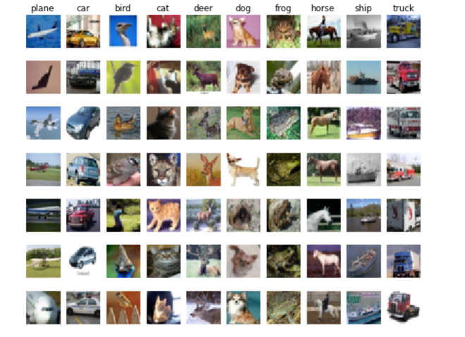

## 0 Basic implementations

Check basic implementations on CIFAR10 in the Deep Learning Lab project [here](https://github.com/RParedesPalacios/DeepLearningLab/tree/master/Examples/CIFAR)

**Goals:**
* Implement some basic convolutional networks
* Implement different data augmentation
* Implement VGG model A

---

## 1 Gender Recognition

Images from "Labeled Faces in the Wild" dataset (LFW) in realistic scenarios, poses and gestures. Faces are automatically detected and cropped to 100x100 pixels RGB.

**Training** set: 10586 images

**Test set**: 2647 images 

**Python Notebook**: [here](gender.ipynb)

**Python code**: [here](gender.py)

**Goals:**
* Implement a model with >95% accuracy over test set
* Implement a model with >90% accuracy with less than 100K parameters
  
  get some inspiration from [Paper](https://pdfs.semanticscholar.org/d0eb/3fd1b1750242f3bb39ce9ac27fc8cc7c5af0.pdf)
    
---

## 2 Advanced topologies 

* Residual Nets
* Wide Resnet 
* Dense Nets

## 3 Car Model identification with bi-linear models

**UNDER CONSTRUCTION**

Images of 20 different models of cars.

**Training** set: 791 images

**Test set**: 784 images 

**Python code**: [here](XXXX)

**Goals:**
* Understand the following Keras implementations:
  * Name the layers
  * Built several models
  * Connect models with operations (outproduct)
  * Understand tensors sizes
  * Create an image generator that returns a list of tensors
  * Create adata flow with multiple inputs for the model
  * Understand the limitations of the proposed solution

  
[Paper](https://pdfs.semanticscholar.org/3a30/7b7e2e742dd71b6d1ca7fde7454f9ebd2811.pdf)

